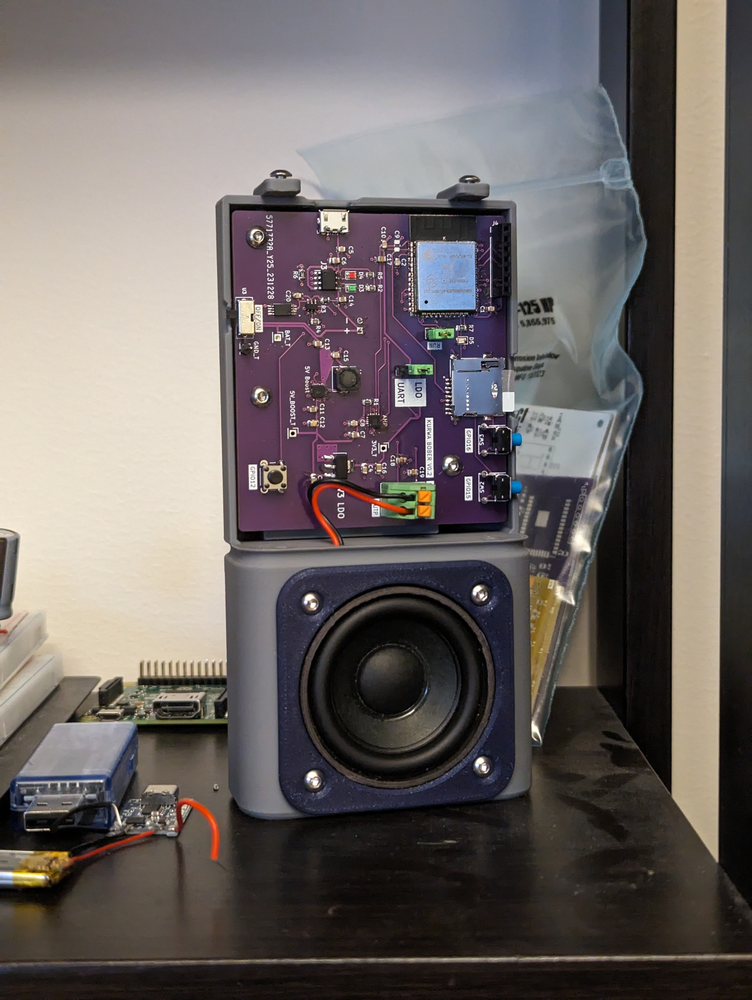

# What is this?

A party game/mp3 player.

Press the button to hear a word. Everyone writes down what they think it means. Double press to hear the answer - those who guessed right get a point. Rinse and repeat.

# Debug PC (Program Counter)

Tool located at: `C:\Users\Strau\.platformio\packages\toolchain-xtensa-esp32\bin>`
Commad to run: `.\xtensa-esp32-elf-addr2line.exe -pfiaC -e C:\Git\esp_audio\.pio\build\esp32dev\firmware.elf -a 0x400874e9`

# Use PlatformIO built in esp32_exception_decoder

From the project dir run: `pio device monitor --filter esp32_exception_decoder`

# Stuff

- Partitions: https://docs.espressif.com/projects/esp-idf/en/latest/esp32/api-guides/partition-tables.html
